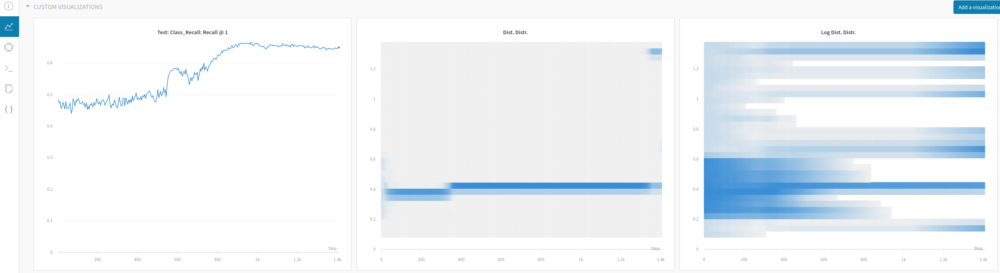

## PADS: Policy-Adapted Sampling for Visual Similarity Learning

---
***Authors:***
* Karsten Roth (karsten.rh1@gmail.com)
* Timo Milbich (timo.milbich@iwr.uni-heidelberg.de)
* Björn Ommer

***Primary Contact:*** Karsten Roth

For baseline implementations, check out https://github.com/Confusezius/Revisiting_Deep_Metric_Learning_PyTorch and the accompanying paper!

---

This repository contains the code to run policy-adapted negative sampling for ranking-based Deep Metric Learning methods, as proposed in our CVPR 2020 publication (https://arxiv.org/abs/2003.11113).  
Sample runs that *can* achieve similar results to those reported in our paper are listed in `SAMPLE_RUNS.sh`, as RL-based methods introduce a higher level of variance.  
However, to foster direct reproducibility, we provide a set of pretrained weights in `Pretrained_Weights` achieving similar results to those shown for each dataset.
Please use this download link: https://www.dropbox.com/sh/9vv72wflxp31bda/AAACBAagUGRJFB94173FNBjza?dl=0. Use `sample_test.py` to see how to use and load the network weights. The comments contain further instructions.


***Note***: Reimplementations of baseline methods are borrowed and adapted from https://github.com/Confusezius/Deep-Metric-Learning-Baselines.

---

### Requirements

We implemented and tested our method using
* Python >=3.6.6
* PyTorch >=1.0.1 and Cuda 8.0, Torchvision >=0.2
* Faiss-gpu >=1.5.1 for Cuda 8.0
* Scikit-Image >=0.14.2, Scikit-Learn >=0.20.3 and Scipy >=1.2.1

Our implementation runs on GPUs with VRAM above 11GB.

---
### How To Use

1. Sample runs to get similar results as mentioned in the paper are listed in `Sample_Runs.sh`.
2. To play with the RL-components, simply look at `PADS_utilities.py`.
3. Some key parameters that can notably influence performance:
  * **Seed** `--seed`.
  * **Margin** choice in Triplet or Margin loss `--beta`, `--margin`, `--beta_lr`.
  * **Learning rate scheduling** `--tau, --gamma`.
  * **Training-Validation Split** and type of split (i.e. per class or by class): `--train_val_split`, `--train_val_split_by_class`. The later denotes that *x%* of classes will be used for training, and *1-x%* for validation. Otherwise, *1-x%* validation samples are taken from training classes.
  * **Policy-Update frequency**/Frequency with which we update the sampling distribution `--policy_sample_freq`. Takes integer values that denote the number of training iterations before updating.
  * **Policy Reward**: `--policy_reward_type`. There are three options: `0` to reward nmi improvements, `1` for recall and `2` for recall+nmi.
  * **Policy Input State Composition**: `--policy_state_metrics`, `--policy_metric_history`. The former receives a list of metrics to compute from the validation set which are to be incorporated into the policy input state. The latter gives the number of past metrics that will be included into the state as well.
  * **Policy Style**: `--policy_mode`. One can use Reinforce or PPO to train the policy. If using PPO, the number of iterations before updating the history policy `--policy_old_update_iter` need to be specified.
  * **Policy Action Space**: `--policy_action_values`. List of floats which give the multiplicators to each sampling bin in the sampling distribution. The action space only has three elements: One reductive multiplicator, one neutral and one incremental, e.g. 0.5 1 2.
  * **Sampling distr. support, support limits and initialisation**: `--policy_n_support`, `--policy_support_limit`, `--policy_init_distr`. The performance depends on the initial choice of the sampling distribution as well as its limits. We found a starting bias around distances in the range [0.3,0.7] to work well and to let the policy figure out good weights from there.

This culminates in an exemplary call to the script like:
```
python main.py
--dataset cars196 --source_path $datapath --gpu 0 --seed 3
--n_epochs 300 --beta_lr 0.0005 --beta 0.6 --tau 140
--wandb_log --wandb_project_name CVPR2020_PADS --train_val_split 0.9
--wandb_group PADS_CARS --samples_per_class 4 --policy_include_pos
--policy_include_same --policy_merge_oobs --policy_sample_freq 30 --policy_reward_type 2
--policy_state_metrics recall dists nmi --policy_mode ppo --policy_metric_history 20
--policy_action_values 0.8 1 1.25 --policy_old_update_iter 5 --policy_init_distr uniform_low
--policy_n_support 30 --policy_support_limit 0.1 1.4 --loss marginloss
```

***Note:*** This project is set up to work well with `wandb` for online logging, which can be activated by setting the `--wandb_log`-flag. In doing so, all metrics will be stored to your *Weights & Biases*-Account, including the progression of the sampling distribution, which is nice to look at and to understand what part of the distance spectrum correlates how/when with performance. A sample run could then look like this (which contains the discrete adaptive sampling histogram in standard and log-style for a specific run):



---
### Description of files in this repo
* `main.py`: Main training script. Calls DML pipeline and PADS.
* `PADS_utilities.py`: Contains all PADS elements.
* `datasets.py`: Dataloaders for each benchmark.
* `losses.py`: DML objectives used.
* `netlib.py`: Architecture of backbone network (ResNet50).
* `evaluate.py`: Evaluation protocols to compute recall and nmi.
* `auxiliaries.py`: Utiliy functions.
* `sample_test.py`: Script to show how use stored network weights.
* `SAMPLE_RUNS.sh`: Contains sample runs to produce good results.

---
### Required Dataset Structure
**CUB200-2011** and **CARS196** should have the following structure:
```
Datasets
└───<cub200,cars197>
    └───images
|       └───001.Black_footed_Albatross/Acura Integra Type R 2001
|           │   Black_Footed_Albatross_0001_796111/00128.jpg
|           │   ...
|       ...
```

**Stanford Online Products (SOP)** should look like
```
Datasets
└───online_products
|   └───images
|       └───bicycle_final
|           │  111085122871_0.jpg
|        ...
└───Info_Files
|    │   bicycle.txt
|    │   ...
```

---
### Citing this Repo/Paper
If you use this repository, method or paper, please cite us via
```
@misc{roth2020pads,
    title={PADS: Policy-Adapted Sampling for Visual Similarity Learning},
    author={Karsten Roth and Timo Milbich and Björn Ommer},
    year={2020},
    eprint={2003.11113},
    archivePrefix={arXiv},
    primaryClass={cs.CV}
}
```
